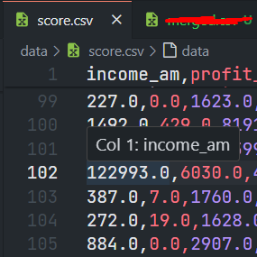
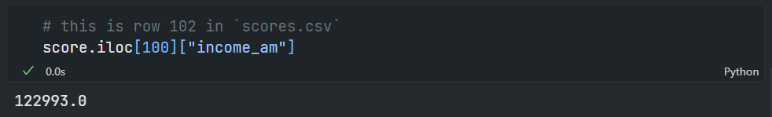

# Guestlist: the 150 accepted guests

There are 2 `.csv` files in this folder. The reason for that is explained in `Answer.ipynb` with code examples.

Also here below, in words (and a bit more clearly)

## Short explanation

In short, during modelling I created a variable called `applicant_id` for each model, because I wanted to later merge all 3 dataframes (1 from each model) together into 1 merged dataframe, so I can get the final guestlist based on all 3 calculated variables. But, that `applicant_id` variable does not line up with the row numbers in the original `score.csv`

So when I say for example:

> applicant 100 was accepted

It is **NOT** the applicant on row 100 of `score.csv` that was accepted, however the applicant with `applicant_id` of 100, which happens to be located on row 102 in `score.csv`.

(the locations are offset by 2)

### Screenshots

## Solution

There are **TWO** `.csv` files:

- `/guestlist/guestlist.csv` contains which `applicant_id`s got accepted

- `/guestlist/guestlist_with_matching_row_number.csv` contains which applicants got accepted based on the row number in `score.csv`
